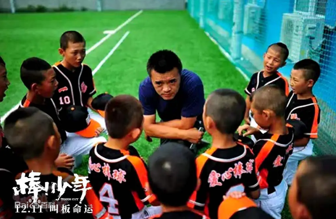
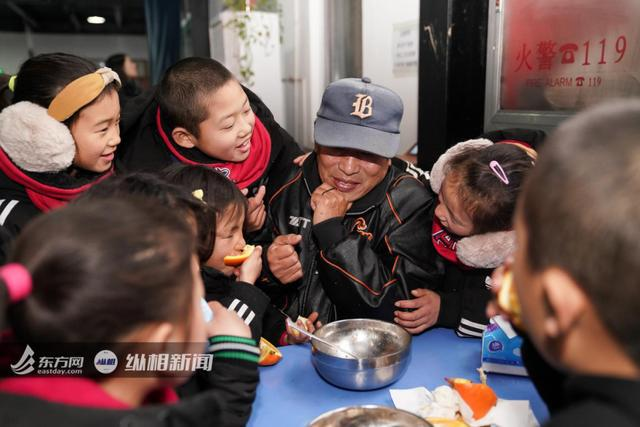

作者：hsil gne

*内含剧透，慎点*

## 编者按

>《棒！少年》如今成为2020年评分最高的记录片,它记录了强棒天使基地里两名少年马虎和小双的成长之路，让我们对这些贫困儿童有了更多的了解。纪录片贵在真实。《棒！少年》的优秀之处在于，
>它真实地反映了这些少年面临的困境，又指明了一条出路，但是这出路也存在着种种困难，甚至仍然是没有希望的尽头，但是在这重重的困难中，所有人表现出的生生不息的精神，让人为之动容，不管是
>小双的孝顺，悔恨，还是马虎后来的懂事和之前的淘气，师爷的辛苦付出和孙岭峰的四处奔走，都让人感叹人性的美好和坚强不惜的品质。《棒！少年》的英文名叫tough out，意思是面对困境靠意志力战胜
>它。它是上一辈棒球人对棒球的tough out，也是这些少年改变自己命运的tough out。

---

## 童年生活

马虎和小双的家境在电影中间不断穿插着进行了交代。马虎是家周围的孩子王，调皮捣蛋，吃百家饭，穿百家衣长大的，母亲在生下他不久之后就跑了，父亲常年在外打工，和奶奶相依为命，但是马虎是个性格底色非常阳光的人，
和我们小时候班上最调皮的学生非常相像，他会自己跳舞，还会狠狠地骂教练，在众人围观的时候，就有很强的表演欲望。即使生活如此对待他，你也感受不到他背负那么多在前行，看到他只是希望虎哥🐯能这么一直虎下去。

小双的身世更令人唏嘘一些，未出生父亲去世，母亲也在生下他不久之后走了，他有个哥哥，但是在小的时候送人了，据说小的时候被送的是他，但是因为他太小了，怕养不活，改送了他哥哥。后来抚养他的大伯去世，
二伯接着抚养他，二伯生了病，小双自己从基地跑了回去。小双比起马虎，看起来更加脆弱敏感一些。失败后的自责，对二伯的担心，小双心里背负了太多东西。

## 基地生活

基地生活是丰富多彩的，马虎第一次吃到饱饭，有了宿舍生活，有了师爷爷，有了棒球。马虎很调皮，一开始也不好好训练，旺盛的精力无处安放，打架滋事，但能感到他需要关注和关心。这样的马虎并不惹人讨厌，反而让人觉得非常可爱。美国赛事后大家一片丧气，也是马虎站出来安慰大家，给大家拿东西吃，以及后来大家都出去训练，只有马虎一个人在基地一次一次挥棒。马虎的成长是可以看得到的，而且他也从基地得到了温暖，原来敌对的大宝教他国歌的时候竟然有一些有爱。他见识到了更大的世界，成长为一个更好的人。马虎是个坦然的人，想要别人对他好，就会使各种方法让别人对他好。这样的马虎成长起来更自然一些。当然，家里虽然贫穷，但是一切安好的背景，还有自己旺盛的体力和精力也给了他不少底气。

小双则相反，小双的基地生活是安静的，努力的。他作为球队里的主力投手，能感到他对基地是有责任感的，他不会主动要求什么，会默默地去做，因为手受伤不能比赛的时候，在那儿顿顿的，也说不出话。去美国参赛的时候，唯一的一分是他拿下的，但还是泪水涟涟。小双对家人也能感到是有责任的，他想照顾二伯，相依为命，想要报答，但是孩子的能力是有限的，他做不了什么，能想到的只有陪伴。所以小双的成长方式是更内敛的，他会放弃很多东西。所有的一切他都想要报答，但是自己的能力好像是有限的。关注强棒的微博会知道小双已经回去了，但是一年的训练已经拉下了，没办法回到从前了。

## 大人们

孙岭峰和张锦新，强棒基地的灵魂人物，开篇的时候孙岭峰就在不断奔走，因为买基地为筹钱而发愁，作为一个已经功成名就的人出来搞这样一项工作，着实令人敬佩。四处奔走，不怕辛苦，从电影还有微博的运营等也可以看出来在努力的想办法往出走，那种求生求好的意志让人感觉异常强烈。张锦新作为孩子们的师爷爷也是一样，就是能感觉到在认真地帮孩子们训练，提高，喜欢这项事业。孙岭峰是中国棒球界的“盗垒王”，张锦新是他的教练，中国棒球的式微，让孙岭峰努力地想要开辟出一条路来。他想的也很周到，棒球是个体系，最优秀的可以去当运动员，进国家队，如果做不到这些，以后也可以进入棒球培训体系，给了这些孩子走出来的一条生路，专业方面，他一个人努力是不够的，自己的师傅操刀，他放心。勤劳勇敢，吃苦耐劳，大概也就这样了吧。

## 孩子们的未来

来这里的孩子的技能确实需要提高，物质生活也可以给足，但是心理可能也是需要关注的重点，尤其是那些内向的孩子们的心理状况。虽然前路艰难，但是见识过更大的世界后，就努力地在这样的世界生存下去，外界的物质和技能帮助已经足够，关爱也足够，这里的每一个人都需要更努力地生活下去，tough it out！

⚾️

---
>请关注[《棒！少年》](https://movie.douban.com/subject/34930862/)
>
>官方微博：[强棒天使队](https://weibo.com/PBangels?sudaref=s.weibo.com)
>
>微信公众号：强棒天使队(powerbaseballangels)
