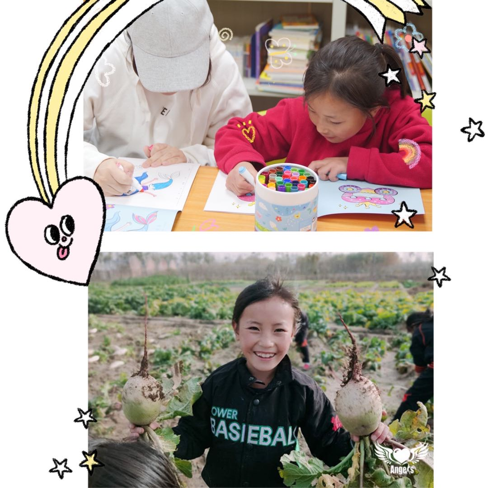

*"编者按：大山里的彝族姑娘 -> 强棒基地的第一批女队员 -> 中国第一支女棒球队成员 -> 未来可期"*

### 强棒及大凉山女子棒球队

2020年12月上映的电影纪录片[《棒！少年》](https://movie.douban.com/subject/34930862/)让大家认识了**强棒天使棒球基地**--前国家棒球队队长孙岭峰与他人联合筹资建设的中国第一支公益棒球队。通过培训7-9岁的贫困儿童棒球技能，帮助他们过上新的生活。想必影片里调皮的马虎和努力的小双都让人印象深刻，觉得又心疼又想给他们鼓励。看着这些孩子一点点地成长，让人由衷地为他们感到高兴。

孙队长并没有停下他资助的脚步，2019年12月，强棒天使基地开始接收女队员，她们大部分来自四川大凉山，是彝族，至今已经有26名成员了。基地老师对女生格外温柔，她们的宿舍和平常的游戏等都会特殊照顾，不让她们丢失女孩的特质，同时培养她们独立拼搏的精神。队员们成长很快，现在已经组成了U10和U12年龄组，成立索玛花(*彝语，即杜鹃花*)女子棒球队，这也是中国第一支女子棒球队。想要了解她们请关注该[视频](https://weibo.com/tv/show/1034:4598808034869318?from=old_pc_videoshow)。

今天让我们走近其中的一朵小花 -- **吾尔作曲**。

### 吾尔作曲
硬照先来两张，不会拔萝卜的小画家不是好投手，哈哈。

吾尔作曲老家在四川凉山州，今年10岁，是个温柔善良的巨蟹座女孩，2020年9月加入基地，加入基地前作曲不会棒球，加入后，通过每天下午几个小时的练习，慢慢掌握了棒球的技能，这也给她带来了快乐。棒球是她喜欢的活动之一。在基地里，除了学习棒球，她们每天上午还要学习文化课，包含语文、数学、画画。画画也是吾尔作曲的爱好之一，数学则是她擅长的项目。看她画的多认真！她的愿望就是有一天可以成为一名老师。

吾尔作曲是很乖很懂事的孩子，她每天都会按时完成作业。在练习过程中，教练会批评，会指出错误，她知道那是为了她好，她会记在心里，接受这些指正，让自己更好的成长。这样的孩子，让我们都多多关注，尽力资助，帮助她们更好地成长，让我们拭目以待。

-----
>***资料来源：***：
>
>1. [强棒天使官方微博](https://weibo.com/PBangels?is_hot=1)
>
>2. 字节跳跳糖公益团队的采访内容等
>
>3. [《新京报》：大凉山走出来的女子棒球队](https://www.bjnews.com.cn/detail/160808745815171.html)
